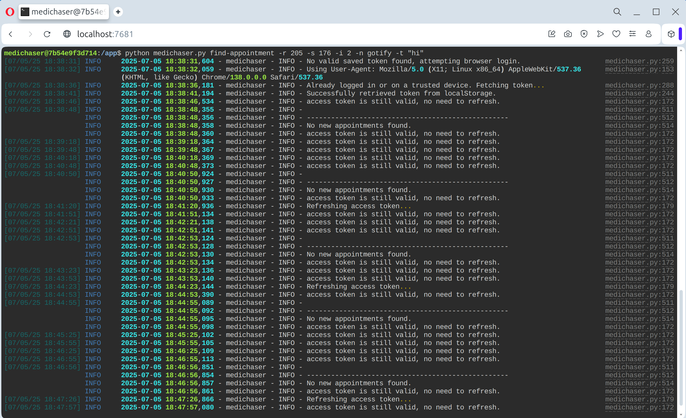

# MediChaser

[](https://hub.docker.com/r/rafsaf/medichaser)
[](https://github.com/rafsaf/medichaser/releases/latest)

MediChaser is a tool for automating Medicover appointment searches. It uses Selenium to interact with the Medicover website, handling login and MFA, and sends notifications when appointments are found.

The application is designed to be run in a Docker container and includes a `ttyd` web terminal for remote management.



---

## Features

- Search for appointments by region, specialty, clinic, doctor, date range, and language at a configurable interval.
- Handles Multi-Factor Authentication (MFA).
- Sends notifications via Gotify, Telegram, Pushbullet, Pushover, and XMPP.
- Remote management through an integrated `ttyd` web terminal.
- Persistent data storage for sessions, tokens, and logs.
- Bullet proof design - created for long runs.
- Shell autocomplete for `medichaser.py`.

---

## How It Works

MediChaser automates Medicover interactions using two login methods, both supporting Multi-Factor Authentication (MFA):

-   **Direct HTTP Requests (Default)**: Fast and efficient, interacting directly with the Medicover API.
-   **Selenium-based Login**: An alternative using a headless browser, which can be enabled with the `SELENIUM_LOGIN` environment variable.

The included `ttyd` service provides command-line access to the container via a web browser.

---

## Setup

**Prerequisites**: Docker and Docker Compose.

1. **Clone the repository:**

    ```bash
    git clone https://github.com/rafsaf/medichaser.git
    cd medichaser
    ```

2. **Create `.env` file:**

    ```bash
    cp .env.example .env
    ```

3. **Configure credentials:**

    Edit the `.env` file with your Medicover username and password.

    ```bash
    MEDICOVER_USER="your_username"
    MEDICOVER_PASS="your_password"
    ```

    Configure notifiers in this file as well (see below).

4. **Run with Docker Compose:**

    ```bash
    docker compose up -d
    ```

5. **Access the web terminal:**

    Navigate to `http://localhost:7681`.

---

## Usage

All commands are run from the web terminal.

### Listing Filters

- **List regions:**

    ```bash
    python medichaser.py list-filters regions
    ```

- **List specialties:**

    ```bash
    python medichaser.py list-filters specialties
    ```

- **List clinics** (example for Warsaw, Pediatrics):

    ```bash
    python medichaser.py list-filters clinics -r 204 -s 132
    ```

- **List doctors** (example for Warsaw, Pediatrics):

    ```bash
    python medichaser.py list-filters doctors -r 204 -s 132
    ```

### Finding Appointments

- **Basic search** (Pediatrician in Warsaw):

    ```bash
    python medichaser.py find-appointment -r 204 -s 132
    ```

- **Search with a date range**:

    ```bash
    python medichaser.py find-appointment -r 204 -s 132 -d 394 -f "2025-12-16" -e "2025-12-19"
    ```

- **Search in one clinic**:

    ```bash
    python medichaser.py find-appointment -r 204 -s 132 -c 49284
    ```

- **Search by language** (Ukrainian-speaking dental hygienist):

    ```bash
    python medichaser.py find-appointment -r 204 -s 112 -l 60
    ```

- **Continuous monitoring and notifications**:

    ```bash
    python medichaser.py find-appointment -r 204 -s 132 -i 15 -n gotify -t "Pediatra Warszawa"
    ```

    To run the monitoring process in the background within the web terminal, you can use `screen`:

    1. Start a new screen session:

        ```bash
        screen -S medichaser
        ```

    2. Run your command with the interval (`-i`) option.
    3. Detach from the session by pressing `Ctrl+A` then `D`. The command will keep running.
    4. To re-attach to the session later, run:

        ```bash
        screen -r medichaser
        ```

    For more information on using screen, check out this [guide](https://www.gnu.org/software/screen/manual/screen.html).

---

## Notifications Setup

Add the required environment variables for your preferred service to the `.env` file.

### Gotify

- `GOTIFY_HOST`: Your server URL (e.g., `http://gotify.example.com:8080`).
- `GOTIFY_TOKEN`: Your app token.
- `GOTIFY_PRIORITY` (Optional): Default is `5`.

### Telegram

- `NOTIFIERS_TELEGRAM_TOKEN`: Your bot token.
- `NOTIFIERS_TELEGRAM_CHAT_ID`: The chat ID to send messages to.

### Pushover

- `NOTIFIERS_PUSHOVER_USER`: Your user key.
- `NOTIFIERS_PUSHOVER_TOKEN`: Your application API token.

### Pushbullet

- `NOTIFIERS_PUSHBULLET_TOKEN`: Your access token.

### XMPP (Jabber)

- `NOTIFIERS_XMPP_JID`: Your full JID (`user@example.com`).
- `NOTIFIERS_XMPP_PASSWORD`: Your password.
- `NOTIFIERS_XMPP_RECEIVER`: The recipient's JID.

---

## Security Considerations

The integrated `ttyd` web terminal provides convenient access to the container's command line. If you are hosting this service on a publicly accessible server, it is crucial to secure the web terminal to prevent unauthorized access.

You can secure `ttyd` by:

- **Using `ttyd`'s built-in authentication**: Change default CMD to enable basic authentication when running container.
- **Using a reverse proxy**: Place a reverse proxy like Nginx or Traefik in front of the `ttyd` service to handle authentication and SSL/TLS termination.

---

## Acknowledgements

This project stands on the shoulders of giants. Big thanks to the original authors and inspirations:

- [apqlzm/medihunter](https://github.com/apqlzm/medihunter)
- [SteveSteve24/MediCzuwacz](https://github.com/SteveSteve24/MediCzuwacz)
- [atais/medibot](https://github.com/atais/medibot)
